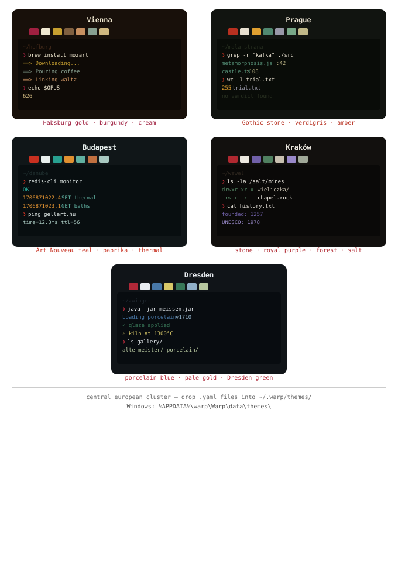
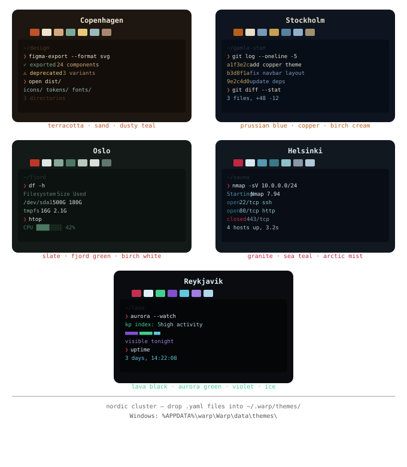
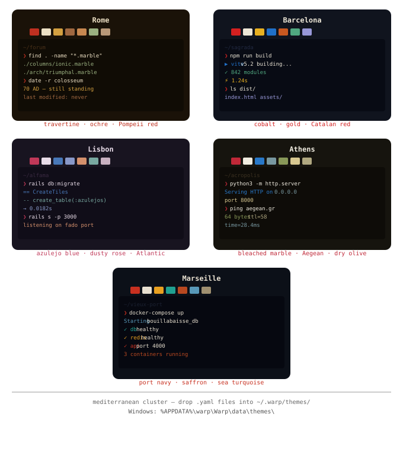
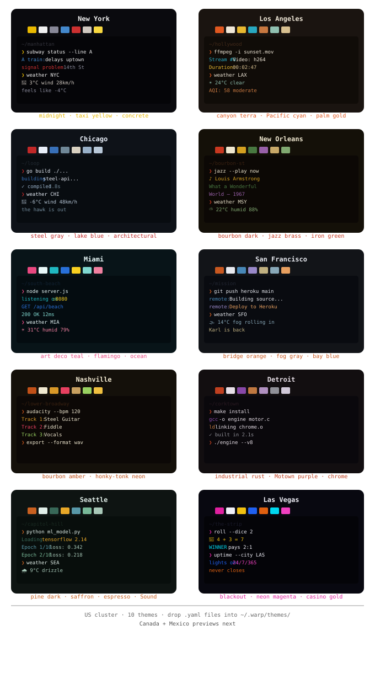
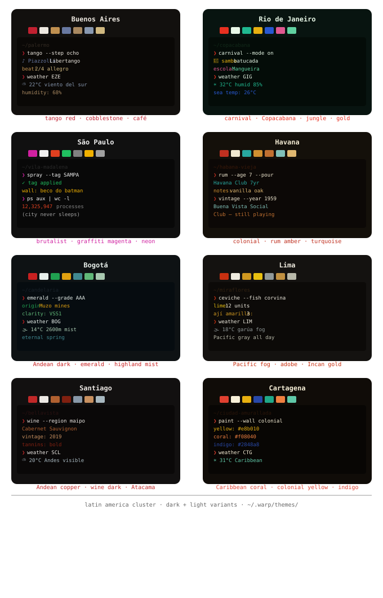
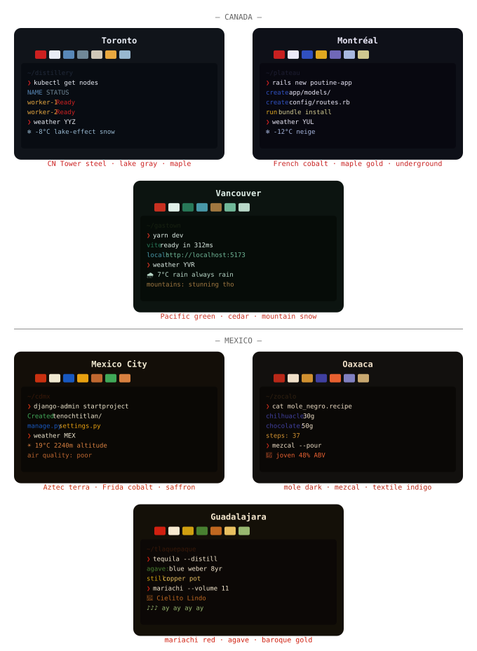
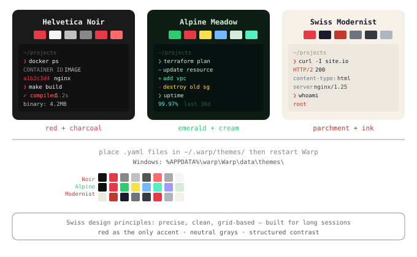
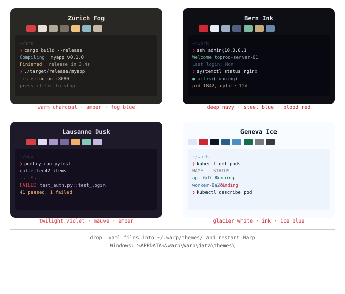

# warp-thematic

---

## Overview

A curated collection of Warp themes organized by geography and design logic. Each set represents a coherent visual system rather than isolated styles.

---

## Gallery

### Europe

Expand

### Americas

Expand

### Swiss / Extended Systems

Expand

---

## Structure
